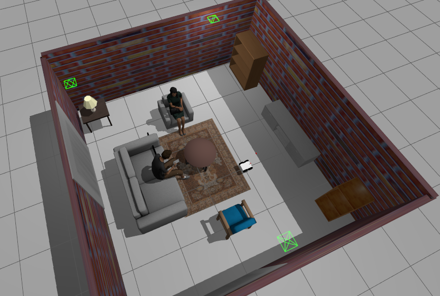
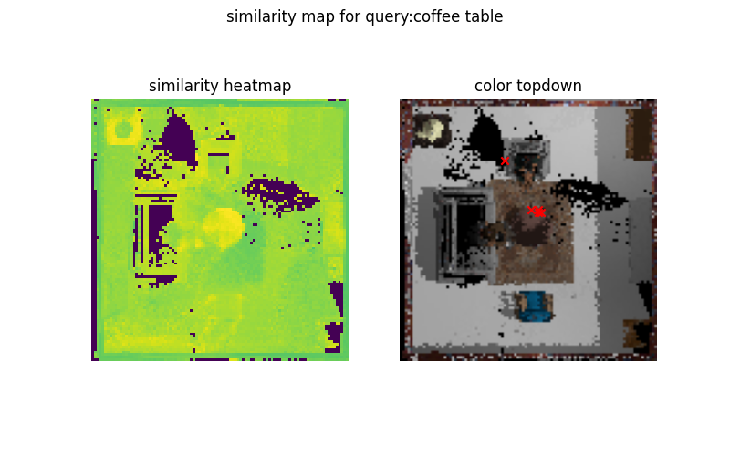
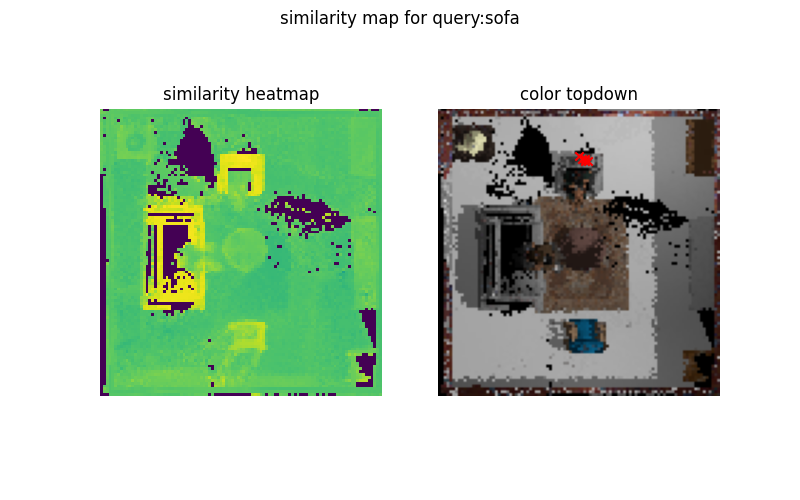
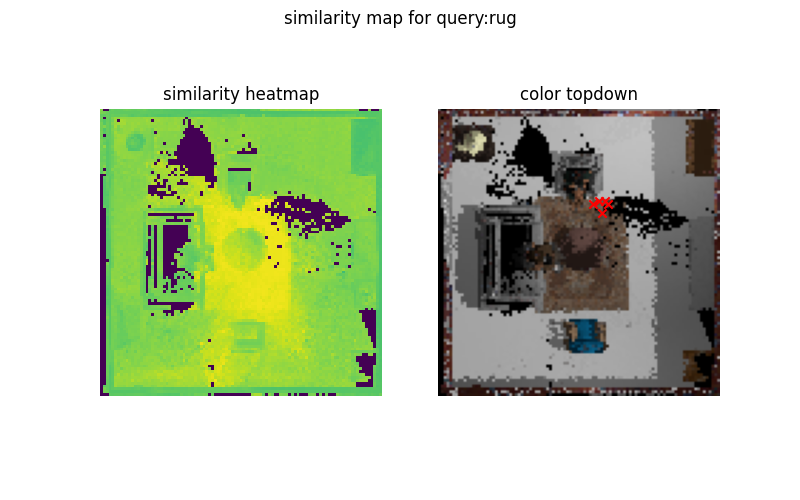
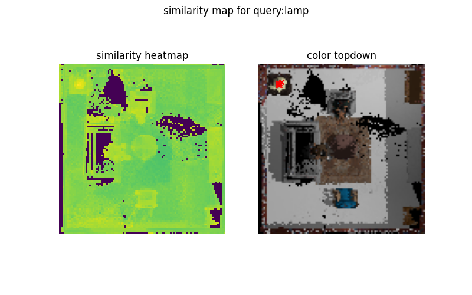

Implementation from paper [Visual Language Maps for Robot Navigation](https://vlmaps.github.io/)  
How it works?  
1. Dense pixel level embeddings are generated for each rgb frame from Posed RGB-D sequence.
2. Using depth information, pixel and lseg features are backprojected into 3D and then subsequently into a 2d grid. This gives a dense 2d grid with semantic information about the environment.
3. During testing, a language query (which is goal object to navigate to), is encoded by CLIP text encoder and cosine similarity with the grid is computed and the grid cell with max cosine similarity is choosen as goal point to navigate to.
4. The navigation is handled by Nav2 stack in ros2. Currently implemented for ros2 Jazzy in Gazebo Harmonic

The gazebo environment is   

Sample images for visualizing similarity in VLMap.  
<table>
  <tr>
    <td></td>
    <td></td>
  </tr>
  <tr>
    <td></td>
    <td></td>
  </tr>
</table>

<video width="100%" controls>
  <source src="assets/test_vid.mp4" type="video/webm">
</video>

